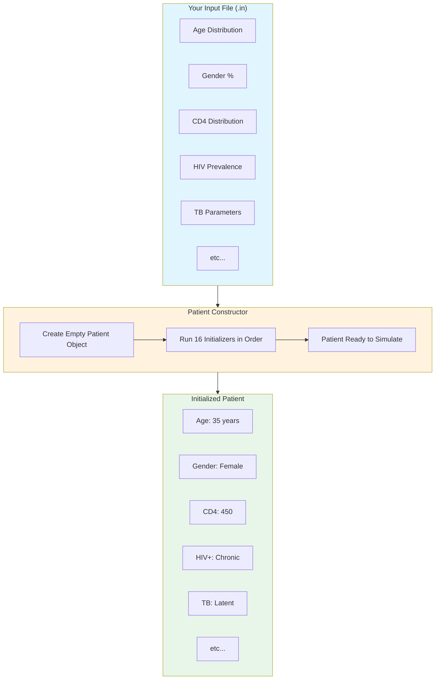
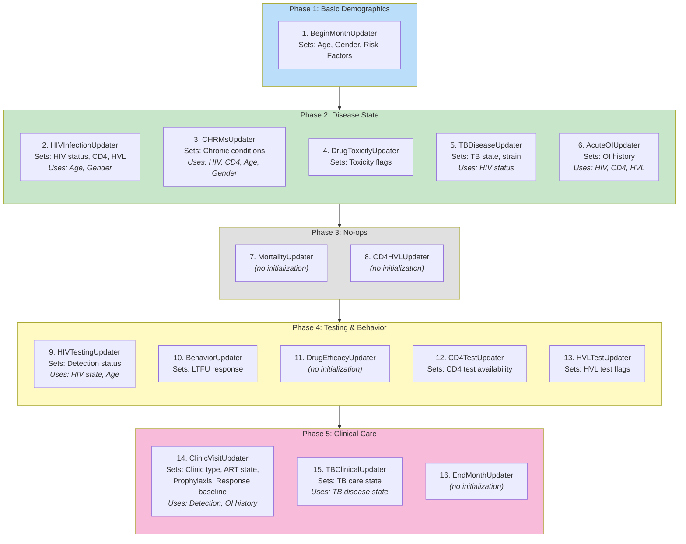
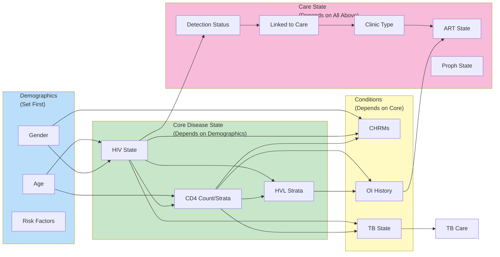
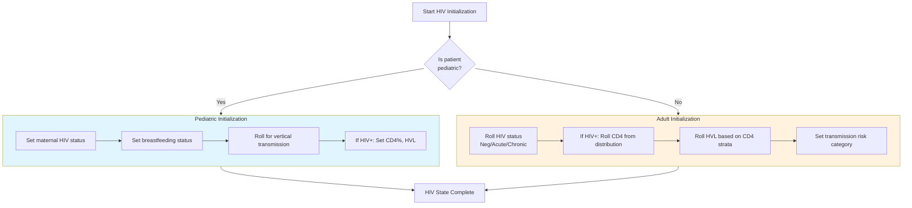
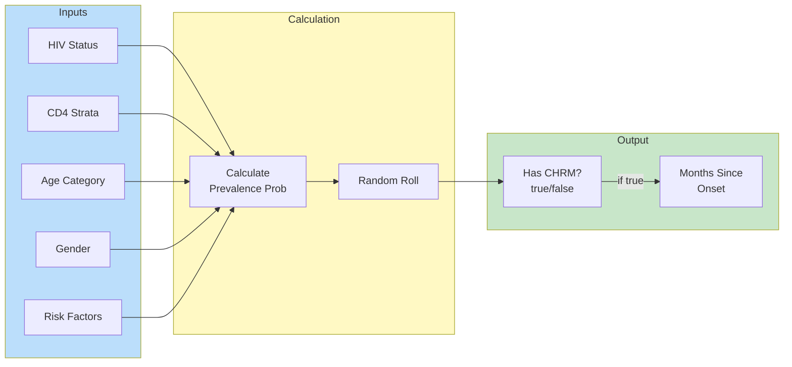
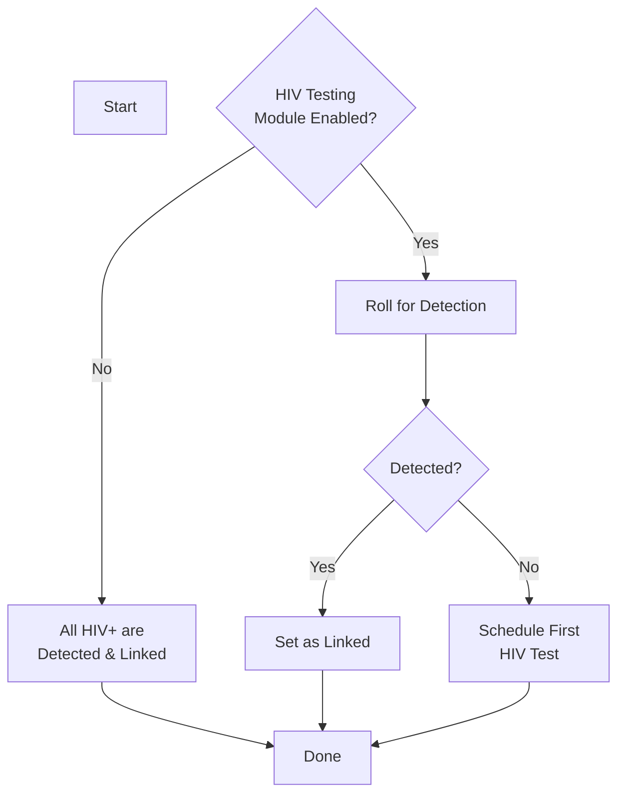
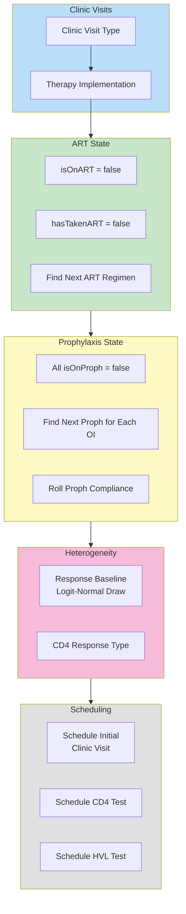
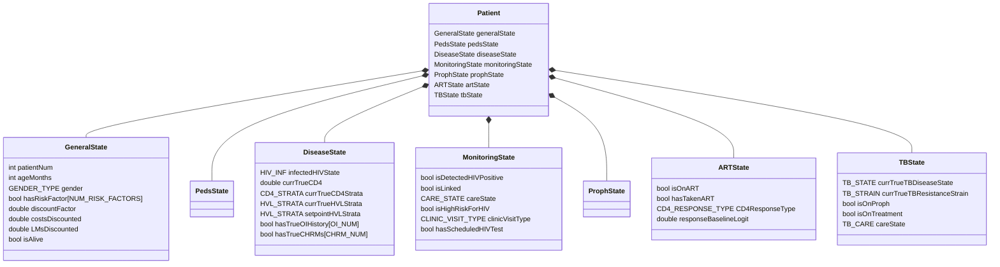

# Patient Initialization Guide

**Audience:** New programmers to the CEPAC codebase who are health policy experts but may be less familiar with C++ code architecture.

> *"You're doing it wrong."*
> — One orange cat, one 3-year-old, and this codebase when you initialize things out of order

> *The cat would like you to know he needs to drink his water now. He will close your laptop if you don't acknowledge this. He also accepts cuddles as tribute.*

---

## What This Document Covers

When CEPAC simulates a patient, it first needs to "create" that patient with all their initial characteristics: age, gender, HIV status, CD4 count, chronic conditions, etc. This document explains exactly how that happens, step by step.

Think of it like filling out a new patient intake form at a clinic, except the computer is rolling dice (using random number generators) to decide each characteristic based on the probabilities you specified in your `.in` input file.

**A note on humility:** You probably think you understand how patient initialization works. The cat on your keyboard and the toddler pulling at your sleeve are both shaking their heads. They've seen your debugging sessions. They know you tried to access CD4 before checking HIV status. They remember. This guide exists so you can prove them wrong (or at least wrong less often).

---

## The Big Picture



---

## The Initialization Sequence

The Patient constructor runs **16 "updater" initializers** in a specific order. This order matters because later initializers often depend on values set by earlier ones.



---

## Dependency Map: What Uses What

This is the critical diagram. It shows **which variables must be set BEFORE others can be calculated**.

> *"NO! You have to do it in ORDER!"*
> — A 3-year-old explaining this dependency graph, also explaining why you can't have dessert before dinner



---

## Step-by-Step: What Each Initializer Does

### Step 1: BeginMonthUpdater - "Who Is This Patient?"

This is the foundation. Everything else depends on these basic demographics.

| Variable Set | How It's Determined | Input File Parameter |
|-------------|---------------------|---------------------|
| **Gender** | Random roll based on male % | `MaleGenderDistribution` |
| **Age** | Drawn from normal distribution | `InitialAgeMean`, `InitialAgeStdDev` |
| **Risk Factors** | For each factor, random roll | `ProbRiskFactorPrevalence[i]` |
| **Age Categories** | Calculated from age | (derived, not input) |

**Why it matters:** Many probabilities in CEPAC vary by age, gender, and risk factors. These must be known first.

---

### Step 2: HIVInfectionUpdater - "HIV Status & Immune State"

This is the **most complex initializer** because it handles both adults and pediatrics differently.

> *The cat's favorite place to knock things over. 330+ lines of initialization code with two completely different paths. Bring snacks.*



**Key Variables Set:**

| Variable | Adults | Pediatrics |
|----------|--------|------------|
| HIV State | `InitialHIVDistribution` | Vertical transmission calc |
| CD4 | `InitialCD4Mean/StdDev` | `InitialCD4PercentageIU/IPMean` |
| HVL | `InitialHVLDistribution[cd4]` | `InitialHVLDistributionIU/IP` |
| Maternal Status | N/A | `MaternalStatusDistribution` |
| Breastfeeding | N/A | `InitialBFDistribution` |

---

### Step 3: CHRMsUpdater - "Chronic Conditions"

For each of the 10 chronic conditions (CHRMs), rolls for prevalence based on:
- HIV status (positive vs. negative)
- Gender
- Age category
- CD4 strata (if HIV+)
- Risk factor adjustments (logit scale)



---

### Step 4: DrugToxicityUpdater - "Toxicity Flags"

Simple: Just sets `hadTBTreatmentMajorTox = false`. No patient starts with prior toxicity.

---

### Step 5: TBDiseaseUpdater - "TB Disease State"

If TB module is enabled, draws:

| Variable | Distribution Used |
|----------|-------------------|
| TB State | `DistributionTBStateAtEntryHIVNeg/Pos` |
| TB Strain | `DistributionTBStrainAtEntry` (DS/MDR/XDR) |
| TB Trackers | `DistributionTBTrackerAtEntry*` |

Possible TB states: Uninfected, Latent, Active Pulmonary, Active Extrapulmonary, Previously Treated, Treatment Default.

---

### Step 6: AcuteOIUpdater - "OI History"

For chronic HIV+ patients, rolls for history of each OI type based on:
- CD4 strata
- HVL strata

**Important side effect:** If ANY OI history is present, the patient's HIV state is upgraded from `HIV_INF_ASYMP_CHR_POS` to `HIV_INF_SYMP_CHR_POS` (symptomatic).

---

### Steps 7-8: MortalityUpdater, CD4HVLUpdater

**No initialization actions.** These just call the parent class.

---

### Step 9: HIVTestingUpdater - "Detection Status"

Determines whether an HIV+ patient is already detected at model entry.



---

### Step 10: BehaviorUpdater - "LTFU Behavior"

Sets the patient's baseline propensity for loss to follow-up (LTFU):
- `preARTResponseBase`: Drawn from logit-normal distribution

---

### Steps 11-13: DrugEfficacyUpdater, CD4TestUpdater, HVLTestUpdater

Minimal initialization:
- CD4 testing marked as "available"
- HVL test chance flag set to false

---

### Step 14: ClinicVisitUpdater - "The Big Clinical Setup"

This initializer sets up the entire clinical care state:



**Key Variables Set:**

| Variable | Source |
|----------|--------|
| Clinic Visit Type | `ClinicVisitTypeDistribution` |
| Therapy Implementation | `TherapyImplementationDistribution` |
| Response Baseline | `PropRespondBaselineLogitMean/StdDev` |
| CD4 Response Type | `CD4ResponseTypeOnARTDistribution` |
| Proph Compliance | `OIProphNonComplianceRisk` |

---

### Step 15: TBClinicalUpdater - "TB Clinical Care"

Sets up TB clinical care state:
- TB Care State: `TB_CARE_UNLINKED` (not linked to TB care initially)
- TB Treatment: All flags false (not on treatment)
- TB Proph: Not on prophylaxis, find next available proph
- TB Interval Policy: Roll for eligibility

---

### Step 16: EndMonthUpdater

**No initialization actions.**

---

## The Patient State Structure

Here's what the final "patient object" looks like after initialization:



---

## Random Number Seeds: Where the "Dice Rolls" Happen

CEPAC uses specific random number "streams" for reproducibility. Here are the key seeds used during initialization:

> *"But I wanted a DIFFERENT number!"*
> — A 3-year-old, also you when your simulation gives different results after you "just moved one line of code"

| Seed | Used For |
|------|----------|
| 20010 | Gender roll |
| 20015-20020 | Age distribution |
| 60050 | Risk factor rolls |
| 90005-90060 | HIV/maternal/pediatric states |
| 10010 | OI history (per OI type) |
| 140010 | TB state |
| 140020 | TB strain |
| 150010 | CHRM prevalence |
| 30005 | Pre-ART response baseline |
| 60010 | Clinic visit type |
| 60030 | Response baseline heterogeneity |
| 100010 | Initial HIV detection |

---

## Common Gotchas for New Developers

> *"I TOLD you so."*
> — The cat, watching you discover these the hard way at 2am

### 1. Order Matters!

You cannot initialize CD4 before you know HIV status, because HIV-negative patients don't get a CD4 roll. Similarly, OI history depends on CD4 and HVL strata.

**The 3-year-old version:** "You can't put on your shoes before your socks! That's SILLY!"

### 2. Pediatric vs. Adult Paths

The HIVInfectionUpdater has completely different logic for pediatrics (vertical transmission, maternal status) vs. adults. Check which path you're on when debugging.

**The cat version:** *closes your laptop because you assumed all patients were adults and he needs to drink his water anyway*

### 3. State Upgrades

The AcuteOIUpdater can **upgrade** HIV state from asymptomatic to symptomatic if OI history is present. This is a side effect that's easy to miss.

**Why you'll get this wrong:** You'll grep for where `HIV_INF_SYMP_CHR_POS` is set, find it in HIVInfectionUpdater, and spend 3 hours confused about why your asymptomatic patient became symptomatic. The answer is in AcuteOIUpdater. The cat knew. The cat always knew.

### 4. Detection != Linked

A patient can be HIV-detected but not yet linked to care. These are separate state variables.

**The 3-year-old version:** "Just because you SEE the cookie doesn't mean you GET the cookie!"

### 5. "No-op" Initializers

Several initializers (Mortality, CD4HVL, DrugEfficacy, EndMonth) do nothing during initialization. They're called for consistency but don't set any variables.

**Why this will confuse you:** You'll read through EndMonthUpdater::performInitialUpdates() looking for the bug, find nothing, and wonder if you've lost your mind. You haven't. It's just empty. The cat is unimpressed by your wasted effort.

---

## Quick Reference: Variable to Input File Mapping

| Patient Variable | Input File Keyword | Initializer |
|-----------------|-------------------|-------------|
| `generalState.gender` | `MaleGenderDistribution` | BeginMonth |
| `generalState.ageMonths` | `InitialAgeMean`, `InitialAgeStdDev` | BeginMonth |
| `diseaseState.infectedHIVState` | `InitialHIVDistribution` | HIVInfection |
| `diseaseState.currTrueCD4` | `InitialCD4Mean`, `InitialCD4StdDev` | HIVInfection |
| `diseaseState.currTrueHVLStrata` | `InitialHVLDistribution` | HIVInfection |
| `diseaseState.hasTrueCHRMs[i]` | `ProbPrevalentCHRMs*` | CHRMs |
| `tbState.currTrueTBDiseaseState` | `DistributionTBStateAtEntry*` | TBDisease |
| `diseaseState.hasTrueOIHistory[i]` | `ProbOIHistoryAtEntry` | AcuteOI |
| `monitoringState.isDetectedHIVPositive` | `ProbHIVDetectionInitial` | HIVTesting |
| `artState.responseBaselineLogit` | `PropRespondBaselineLogitMean/StdDev` | ClinicVisit |
| `artState.CD4ResponseType` | `CD4ResponseTypeOnARTDistribution` | ClinicVisit |

---

## Code Locations

| Component | File | Key Lines |
|-----------|------|-----------|
| Patient Constructor | `Patient.cpp` | 20-84 |
| BeginMonthUpdater init | `BeginMonthUpdater.cpp` | 14-129 |
| HIVInfectionUpdater init | `HIVInfectionUpdater.cpp` | 14-346 |
| CHRMsUpdater init | `CHRMsUpdater.cpp` | 14-75 |
| TBDiseaseUpdater init | `TBDiseaseUpdater.cpp` | 14-87 |
| AcuteOIUpdater init | `AcuteOIUpdater.cpp` | 14-49 |
| HIVTestingUpdater init | `HIVTestingUpdater.cpp` | 14-95 |
| ClinicVisitUpdater init | `ClinicVisitUpdater.cpp` | 16-140 |
| TBClinicalUpdater init | `TBClinicalUpdater.cpp` | 14-53 |
| StateUpdater base | `StateUpdater.cpp` | 18-24 |

---

## Summary

When a new patient is created in CEPAC:

1. **Demographics first** (age, gender, risk factors)
2. **Core disease state** (HIV, CD4, HVL) - depends on demographics
3. **Comorbidities** (CHRMs, TB, OIs) - depends on core disease
4. **Detection & behavior** - depends on HIV status
5. **Clinical care setup** (clinic type, ART, proph) - depends on everything above

Each step uses random number draws from distributions you specify in your `.in` file. The order is fixed because of these dependencies.

---

## TL;DR: The "I Have a Grant Deadline" Quick Reference

> *For when you need answers NOW, the cat is actively sitting on your keyboard, and the 3-year-old wants you to come play*

### What file do I look at?

| I need to understand... | Look here |
|------------------------|-----------|
| How patients are created | `Patient.cpp:20-84` |
| Age/gender initialization | `BeginMonthUpdater.cpp:14-129` |
| HIV/CD4/HVL setup | `HIVInfectionUpdater.cpp:14-346` |
| Why my patient has a CHRM | `CHRMsUpdater.cpp:14-75` |
| TB initialization | `TBDiseaseUpdater.cpp:14-87` |
| OI history logic | `AcuteOIUpdater.cpp:14-49` |
| Detection status | `HIVTestingUpdater.cpp:14-95` |
| ART/Proph/Clinic setup | `ClinicVisitUpdater.cpp:16-140` |

### The 5 things you WILL mess up (and how to fix them)

| Your Bug | The Fix |
|----------|---------|
| CD4 is garbage/undefined | Check HIV status first. HIV- patients don't get CD4 initialization. |
| Patient became symptomatic mysteriously | Check OI history in `AcuteOIUpdater`. It upgrades HIV state as a side effect. |
| Pediatric code isn't running | Check `isPediatric` flag. It depends on age AND module settings. |
| Patient should be on ART but isn't | Detection and linkage are SEPARATE. Check both `isDetectedHIVPositive` AND `isLinked`. |
| Random outputs changed unexpectedly | You changed initialization order. The RNG seeds are position-dependent. |

### The dependency chain (memorize this)

```
Age/Gender  -->  HIV Status  -->  CD4  -->  HVL  -->  OI History
                     |             |
                     v             v
                 Detection     CHRMs, TB
                     |
                     v
              Linked to Care
                     |
                     v
              ART/Proph/Clinic
```

**If something downstream is wrong, check everything upstream first.**

### The 30-second mental model

1. Patient starts as an empty shell
2. 16 initializers run in strict order (like dominoes)
3. Each initializer reads from your `.in` file and rolls dice
4. Later initializers use values from earlier ones
5. After step 16, patient is ready for `simulateMonth()` loop

### When the cat is right and you are wrong

The cat is right when:
- You access a variable before its initializer has run
- You assume pediatric and adult paths are the same
- You forget that OI history can change HIV state
- You think "detected" means "linked to care"
- You modify initializer order and expect the same outputs

The 3-year-old is right when:
- You try to run before you can walk (skip to ART state before HIV state)
- You ask "why?" and the answer is "because the code says so"
- You insist something should work a certain way but it doesn't
- They say "come play!" and you've been debugging for 4 hours straight (take the break)

The cat is also right when:
- He closes your laptop (you needed a break anyway)
- He demands cuddles (see above)
- He drinks his water loudly to remind you to hydrate

---

## Final Words

You now know more about patient initialization than 99% of people who will ever touch this codebase. The cat remains skeptical but will accept cuddles as acknowledgment of your progress. The 3-year-old has moved on to asking why the sky is blue and wants you to come play.

When you find yourself debugging at midnight, remember: the order matters, the side effects are real, and somewhere, a cat is about to close your laptop because he needs to drink his water and you've been staring at `HIVInfectionUpdater.cpp` for three hours.

Take breaks. Cuddle the cat. Play with the 3-year-old. The code will still be wrong when you get back, but you'll be better equipped to fix it.

Good luck. You'll need it.

*— The CEPAC Codebase (and the cat, who is now sitting on your keyboard and would like his water)*
